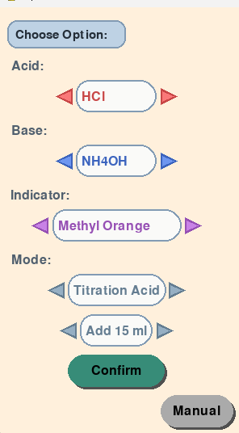
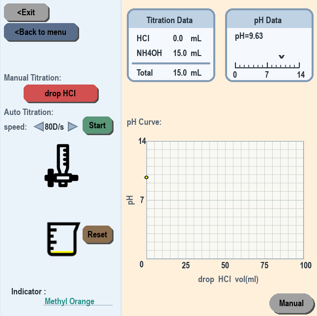

# 🧪 Acid-Base Titration Virtual Lab

### ⚗️ A lightweight, pure Python interactive simulation system, synchronized in real-time with a cloud spreadsheet!

---

## 📌 Table of Contents

* 🎯 Overview
* 🌟 Features
* 🖼️ Demo
* 🏗️ Architecture & Workflow
* 📂 Project Structure
* 📦 Modules
* 🔬 Theory & Algorithm
* 🎨 UI Design
* ⚙️ Installation
* 🖥️ Usage
* 📋 Requirements
* 🚀 Future Roadmap
* 📝 Development Insights
* 📄 License
* 🙏 Acknowledgements & Contact

---

## 🎯 Overview

This project is an **interactive acid-base titration virtual laboratory** specifically designed for science education and self-directed learning. It effectively addresses common pain points in traditional physical laboratories, such as chemical waste, equipment limitations, and the hazards of handling strong acids and bases. Users can freely mix different acidic/basic solutions and indicators to perform highly realistic titration simulations in a completely safe digital environment.

---

## 🌟 Features

* **Lightweight & Pure Python**: No need to download massive pre-packaged executables. The codebase remains completely transparent, secure, fast to download, and ready to run instantly.
* **Smart Dynamic pH Calculation Core**: Built-in non-linear chemical formula solvers accurately calculate four classic combinations: "Strong Acid + Strong Base", "Strong Acid + Weak Base", "Weak Acid + Strong Base", and "Weak Acid + Weak Base", perfectly simulating buffer regions and salt hydrolysis.
* **Real-time Cloud Database Integration**: Chemical properties and constants are hosted on Google Sheets. The system automatically syncs the latest parameters in the background upon startup and features an offline caching mechanism.
* **Highly Realistic Real-time Feedback**:
  * Supports 6 mainstream acid-base indicators (Phenolphthalein, Methyl Orange, Bromothymol Blue, Methyl Red, Thymol Blue, Phenol Red). The liquid color in the beaker evolves dynamically based on the current pH value.
  * Real-time plotting of the pH titration curve, which **automatically captures and labels the "Equivalence Point"** when neutralization is reached.

---

## 🖼️ Demo

### Option Page


### Main Page


---

## 🏗️ Architecture & Workflow

### 1. System Workflow

```text
[ Launch main.py ]
        │
        ▼
[ data.py: Background Sync ] ───(Connected)───► Download Google Sheets & save as data.xlsx
        │                                             │
        │(Connection Failed)                          ▼
        └─────────────────────────────────────► Read local data.xlsx cache and parse
                                                      │
                                                      ▼
                                            [ option.py: Configuration Menu ] ◄───► Read manual.txt
                                                      │
                                                   (Confirm)
                                                      │
                                                      ▼
                                            [ main.py: Main Lab ] ◄────► [ beaker.py: Dynamic Reaction & Color ]
                                                                          [ ui.py    : Custom UI Rendering ]

```

### 2. Algorithm and Data Flow

* When the user triggers a titration step or enables auto-titration, the system calculates the added moles of titrant.
* This data is passed to the `pH_update` calculation core, which returns the latest pH value using non-linear chemical equations.
* `beaker.py` updates the liquid volume, total moles, and dynamically calculates the color of the liquid based on the selected indicator.
* `main.py` appends the pH history to plot the real-time curve and detects sudden slope changes to accurately mark the equivalence point.

---

## 📂 Project Structure

```text
.
├── code/
│   ├── main.py        # Main entry point, lab interface rendering, and dynamic pH calculation core
│   ├── option.py      # Setup menu for configuring chemical reagents, indicators, and initial parameters
│   ├── beaker.py      # Beaker class (manages volume, moles, and dynamic color state transitions)
│   ├── data.py        # Cloud database integration (fetches Google Sheets and parses local Excel cache)
│   └── ui.py          # Common UI components (custom rectangular buttons, triangular speed-control buttons)
├── images/
│   ├── beaker.png     # Beaker visual asset
│   └── burette.png    # Burette visual asset
├── manual/
│   ├── manual.md      # Lab operation manual (Markdown version)
│   └── manual.txt     # Lab operation manual (Plain text version)
├── .gitignore         # Git ignore file (excludes local cached data.xlsx)
└── README.md          # Project homepage and documentation (this file)

```

---

## 📦 Modules

* **`main.py` (Main Program & Core Algorithm)**: Runs the Pygame main loop, renders the real-time titration data card, visualizes the pH scale, and plots the dynamic titration curve. It houses the core equilibrium chemical calculation logic.
* **`option.py` (Configuration Menu)**: An independent setup screen. It utilizes custom geometric algorithms (such as the `point_in_triangle` collision detection) to handle user interaction as they configure acids, bases, indicators, mode, and initial volumes.
* **`beaker.py` (Beaker Simulation)**: Encapsulates the physical and chemical states of the beaker. It dynamically tracks the cumulative volume and total moles, and contains color-changing ranges for the 6 indicators to determine the gradient and hex color of the solution.
* **`data.py` (Cloud Connection)**: Uses `urllib.request` to export the cloud Google Sheets data as an XLSX file. If the network is unavailable, it catches the exception and gracefully falls back to reading the local cache, ensuring high availability.
* **`ui.py` (Generic UI Components)**: Implements custom graphical button widgets supporting rectangular and triangular shapes. It features built-in hover effects and pressed scaling for responsive visual feedback.

---

## 🔬 Theory & Algorithm

Rather than using basic linear approximations, this system performs non-linear equation solving based on true thermodynamic equilibrium constants ($K_a$, $K_b$, $K_w$):

### 1. Strong Acid + Strong Base ($HCl + NaOH$)

Complete dissociation occurs. The pH is determined strictly by the concentration of excess $H^+$ or $OH^-$ ions:

* **Excess Acid**:

$$\text{pH} = -\log_{10}\left(\frac{H_{\text{total}} - OH_{\text{total}}}{V_{\text{total}}}\right)$$


* **Excess Base**:

$$\text{pH} = 14 + \log_{10}\left(\frac{OH_{\text{total}} - H_{\text{total}}}{V_{\text{total}}}\right)$$


### 2. Strong Acid + Weak Base ($HCl + NH_4OH$) / Weak Acid + Strong Base ($CH_3COOH + NaOH$)

These mixtures involve conjugate acid-base pairs:

* **Before the Equivalence Point (Buffer Region)**: Calculated precisely using the **Henderson-Hasselbalch Equation**.
* **At the Equivalence Point (Salt Hydrolysis)**: Calculated by determining the hydrolysis constant of the resulting salt (e.g., $K_h = \frac{K_w}{K_a}$) and solving for the hydrolysis equilibrium.
* **After the Equivalence Point**: The pH is dominated by the excess concentration of the strong titrant.

### 3. Weak Acid + Weak Base ($CH_3COOH + NH_4OH$)

The system's pH is limited by the relative dissociation constants of both weak species. The pH at the equivalence point is estimated using:

$$\text{pH} = 7 + \frac{1}{2}(\text{p}K_a - \text{p}K_b)$$

---

## 🎨 UI Design

* **Color Palette**: The main theme utilizes a comfortable, retro parchment-colored background (`255, 240, 220`) combined with modern tech-blue functional cards (`235, 243, 250`), significantly reducing eye strain during long simulation sessions.
* **Dynamic Feedback**: All buttons support three distinct states (Normal, Hover, Pressed). The liquid level in the beaker dynamically scales geometrically based on the volume ratio (`volume / max_volume`).

---

## ⚙️ Installation

Make sure you have **Python 3.x** installed on your system. Open your Terminal (macOS/Linux) or Command Prompt (Windows) and run the following command to install the required dependencies:

```bash
pip install pygame openpyxl

```

---

## 🖥️ Usage

### 1. Launch the Lab

Navigate to the project root directory (`OH_H`) and execute the main script:

```bash
python code/main.py

```

### 2. Local Sync & Updates

This project supports Git version control. If chemical formulas or UI elements are updated upstream, you can synchronize your local copy instantly without redownloading files by running:

```bash
git pull origin main

```

### 3. Experimental Steps

1. **Configure Parameters**: Use the left and right arrow keys in the menu to set up your experiment. Click **[Manual]** to view `manual.txt`. Click **[Confirm]** when ready.
2. **Perform Titration**: Click **[drop]** to add titrant manually drop-by-drop, or click **[Start]** to initiate continuous auto-titration (adjust the speed using the triangular buttons next to the `speed` label).
3. **Observe and Reset**: Monitor the real-time titration curve and the marked equivalence point on the right. Click **[Reset]** to clear the beaker, or click **[Back to menu]** to return to the setup screen.

---

## 📋 Requirements

* **Operating System**: Windows 10/11, macOS, or Linux
* **Python Version**: Python 3.8 or higher
* **Core Dependencies**:
* `pygame >= 2.0.0` (Graphical interface and real-time rendering)
* `openpyxl >= 3.0.0` (Local XLSX data table parsing)


---

## 🚀 Future Roadmap

* **Polyprotic Acid Titration**: Support polyprotic systems (e.g., $H_2SO_4$, $H_2C_2O_4$) and plot curves featuring multiple equivalence points.
* **Data Export**: Allow users to export `ph_history` and volume datasets to a CSV spreadsheet with one click for external statistical analysis.
* **Animation Enhancements**: Add realistic droplet gravity physics and a rotating magnetic stirrer animation inside the beaker.

---

## 📝 Development Insights

The primary development hurdle was simulating the **highly non-linear pH jump near the equivalence point** for weak acids and bases. Simple linear interpolation fails to capture the abrupt "titration break" characteristic of actual chemistry. By implementing thermodynamic dissociation equilibrium equations combined with Pygame's high-frequency tick rate, the system successfully renders highly realistic chemical reaction curves in a digital environment.

---

## 📄 License

This project is licensed under the **MIT License**. You are free to copy, modify, distribute, and use this software for both personal and commercial purposes, provided that the original copyright notice is included in any derivative works.

---

## 🙏 Acknowledgements & Contact

* **Guidance & Cloud Hosting**: Special thanks to Google Sheets for providing a reliable cloud database.
* **Author**: [Xmlin]
* **Project Link**: [https://github.com/Xm-lin/OH_H-chemical-lab-project-in-pygame]

## ⚙️ Installation

Make sure you have **Python 3.x** installed on your system. Run the following command in your terminal to install all required dependencies at once:

```bash
pip install -r requirements.txt
